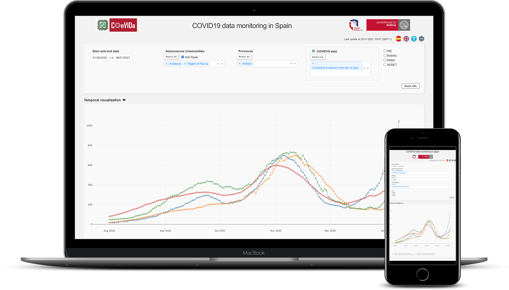

<!-- PROJECT LOGO -->
<br>
<p align="center">
  <a href="https://convida.inf.um.es">
    
  </a>

  <h3 align="center">COnVIDa frontend</h3>

  <p align="center">
    Python frontend for visualization and analysis of COVID19 data in Spain
    <br><br>
    
  </p>
</p>


<!-- TABLE OF CONTENTS -->
## Table of Contents

* [About the Project](#about-the-project)
* [Getting Started](#getting-started)
  * [Prerequisites](#prerequisites)
  * [Installation](#installation)
  * [Run App](#running-an-app-locally)
  * [User Manual](#user-manual)
* [Usage](#usage)
* [Tools](#tools)
* [License](#license)
* [Contact](#contact)


<!-- ABOUT THE PROJECT -->
## About the project

COnVIDa ([https://convida.inf.um.es](https://convida.inf.um.es)) is a tool developed by the Cybersecurity and Data Science Laboratory at the University of Murcia (Spain) that allows to easily gather data related to the COVID19 pandemic form different data sources, in the context of Spain.

In this repository, you will find everything you need for the analysis and visualization of the data collected by the backend ([COnVIDa-lib](https://github.com/CyberDataLab/COnVIDa-lib)). This web interface allows you to select intuitively the data you want to analyze and compare it with the rest of the selected data, as well as the possibility of downloading this data in different formats for your own analysis.

We developed the web interface using **Flask + Dash**, which is enough to run the web application locally.

If your intention is to take this web application to a **production environment**, it will be necessary to use a **Web Server Gateway Interface (WSGI)**. 

On our page [convida.inf.um.es](https://convida.inf.um.es) we use:

* [Nginx](https://www.nginx.com/)
* [Flask](https://flask.palletsprojects.com/) + [Dash](https://plotly.com/dash/)
* [uWSGI](https://uwsgi-docs.readthedocs.io/)


With WSGI we can redirect the user requests to the script in Python, in our case ```main.py```. 
For a production environment it is advisable to set the global variable ```DEBUG = False``` in ```main.py```.

NOTE: There are other valid alternatives for the deployment of the service.


<!-- GETTING STARTED -->
## Getting Started

COnVIDa frontend is composed of two main elements:
* ```main.py```: Core implementation of the frontend functionality.
* ```COnVIDa-lib```: Contains the Python library developed to collect data from the different data sources, [COnVIDa-lib](https://github.com/CyberDataLab/COnVIDa-lib)

### Prerequisites

* Python version 3.7 or more, pyenv recommended
* pip3


### Installation

1. Clone the repo
```sh
git clone --recurse-submodules https://github.com/CyberDataLab/COnVIDa.git
```
With ```--recurse-submodules``` you will also get the [COnVIDa-lib](https://github.com/CyberDataLab/COnVIDa-lib) associated to the frontend.
If you wish, you can choose to download only the frontend
```sh
git clone https://github.com/CyberDataLab/COnVIDa.git
```
and create your own library or adapt ours to new data sources of your interest.

2. Change to COnVIDa directory
3. (Optional) Create your virtual environment, and activate it (you can also use ```conda``` to create the virtual environment)
```sh
python -m venv env

source env/bin/activate  # Linux/Mac
env/Scripts/activate  # Windows
```
3. Install required packages
```sh
pip3 install -r requirements.txt
```

<!-- RUN APP-->
## Running an app locally

To run an app locally:

1. Run main.py
```sh
python main.py
```
2. Open http://127.0.0.1:8899 or http://localhost:8899 in your browser

To change the web service port, change the global variable ```PORT``` in ```main.py```

## User Manual

* https://convida.inf.um.es/help (English)

* https://convida.inf.um.es/ayuda (Spanish)


<!-- USAGE EXAMPLES -->
## Usage

### ```main.py```

The main.py file is the core of the website's functionality. We will find all the functions and parameters needed to modify any aspect of the website. 
Some considerations should be taken:

* ```DEBUG``` variable should be changed according to whether we are in a development or production environment. 

* The following code included in the main.py allows you to obtain all the data from the COnVIDa library and load it into memory to later display it on the web.
```sh
def daily_update():
    print("Starting Thread...")
    while True:
        time.sleep(86400)  # 1 day
        nAttemps = 0  # 3 attemps
        try:
            while ((not convida_server.daily_update()) and (nAttemps < 3)):
                nAttemps += 1
                print(nAttemps)
                time.sleep(240)
            if (nAttemps < 3):
                f = open("/app/log/update.txt", "w")
                f.write("Updated!")
                f.close()
        except:
            print("Thread Critical Error")
```
We have used a thread that loads the new data into memory once a day with a maximum of three attempts.
Once the data have been loaded, the service will be automatically restarted to finish loading the new data.

* Each one of the defined functions are commented in the code, where a small summary is given about the purpose of such function, as well as its input and output parameters.

* We have used a Dash functionality called _callback_ for user interaction with the different options on the web.
This allows us to declare which is the **input** parameter (the one that triggers this function) and what is going to be generated as an **output**.

An example of the use of callbacks would be

```sh
@dash_app.callback(
    Output("selected_regions", "value"),
    [Input("select_all_regions_button", "n_clicks")],
)
def select_all_regions(n_clicks):
    if n_clicks > 0:
        return [dropdown_option.get("label") for dropdown_option in regions_options]
    return []
```

In this case when we click on the button with ```id="select_all_regions_button"```, the resulting output will be to add all the region names to the appropriate dropdown.

### ```assets```

It contains the style files of the web page, as well as the images, the static HTML pages and the javascript necessary for the correct operation of the web.

* The file _convida_dict.json_ contains the Spanish-English translation for each of the labels on the website. This dictionary allows easily including further languages in the future.

### ```tmp```
The ```tmp``` folder at run time will contain the files ,in different formats, with the data you have selected. These files must be deleted periodically in order not to exceed the storage of the server. To this end, we launch a thread that checks and deletes the contents of this folder.


### ```log```
The data on our website are updated daily from each of the sources we have. In each of these updates, we record if it has been done correctly, along with the date and time at which it was done.
This is used by our service to know what data can be offered on our website, as well as for the administrators in case there is any error.

<!-- Tools -->
## Tools
* [COnVIDa-lib](https://github.com/CyberDataLab/COnVIDa-lib)
* [Dash](https://plotly.com/dash/)
* [Flask](https://flask.palletsprojects.com/)
* [uWSGI](https://uwsgi-docs.readthedocs.io/)


<!-- LICENSE -->
## License

Distributed under the MIT License. See `LICENSE` for more information.


<!-- CONTACT -->
## Contact

CyberDataLab - [@cyberdatalab](https://twitter.com/cyberdatalab) 

Contact us through [convida@listas.um.es](mailto:convida@listas.um.es)

Entire COnVIDa project: [https://github.com/CyberDataLab/COnVIDa-dev](https://github.com/CyberDataLab/COnVIDa-dev)
